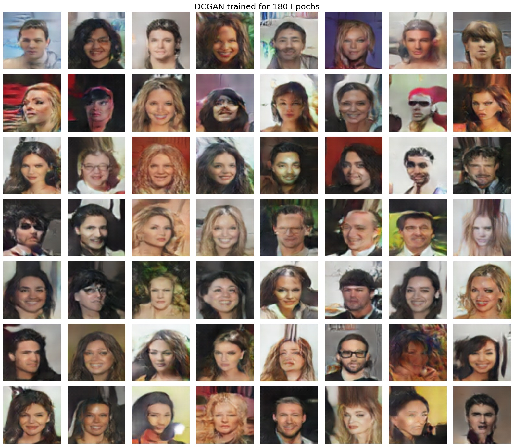
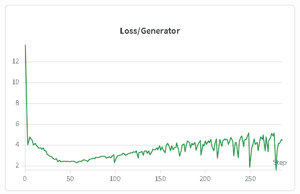
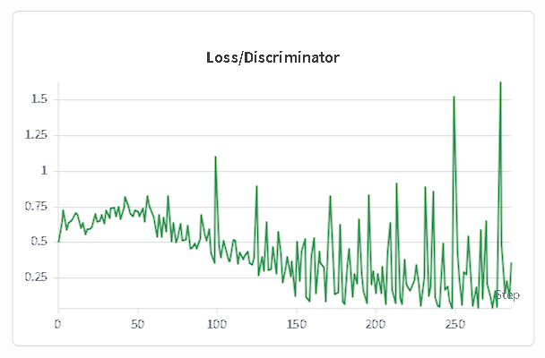
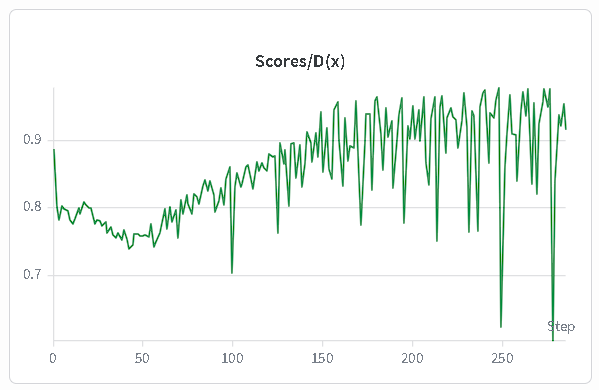
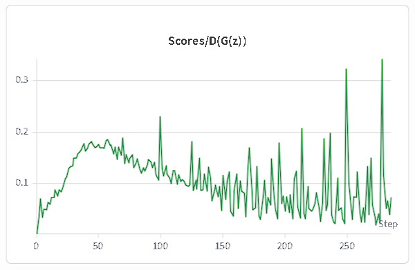

# Generative Adversarial Nets (GAN)

$$ V(G,D)=\mathbb{E}_{x \sim p_{\text{data}}(x)}[\log D(x)] + \mathbb{E}_{z \sim p_z(z)}[\log(1-D(G(z)))] $$

For the optimal discriminator:

$$ D^*(x)=\frac{p_{\text{data}}(x)}{p_g(x)+p_{\text{data}}(x)} $$

If:

$$ p_g(x)=p_{\text{data}}(x) $$

then:

$$ D^*(x)=\frac{1}{2} $$

The GAN minimax game at equilibrium becomes:

$$ V(G,D^*)=-\log 4 + 2JSD(p_{\text{data}} \| p_g) $$

Where the Jensen-Shannon divergence is defined as:

$$
JSD(p \| q)=
\frac{1}{2}
D_{KL}
\left(
p \Bigg\| \frac{p+q}{2}
\right)
+
\frac{1}{2}
D_{KL}
\left(
q \Bigg\| \frac{p+q}{2}
\right)
$$

Gradient with respect to the discriminator parameters:

$$
\nabla_{\theta_d}V(G,D) = \frac{1}{m} \sum_{i=1}^{m} \left( \frac{\nabla_{\theta_d}D(x^{(i)};\theta_d)}{D(x^{(i)};\theta_d)} - \frac{\nabla_{\theta_d}D(G(z^{(i)};\theta_g);\theta_d)}{1-D(G(z^{(i)};\theta_g);\theta_d)} \right)
$$

Gradient with respect to the generator parameters:

$$
\nabla_{\theta_g}V(G,D) = - \frac{1}{m} \sum_{i=1}^{m} \frac{\nabla_{\theta_g}D(G(z^{(i)};\theta_g);\theta_d) \cdot \nabla_{\theta_g}G(z^{(i)};\theta_g)}{1-D(G(z^{(i)};\theta_g);\theta_d)}
$$

---

# DCGAN-PyTorch-Implementation-From-Scratch

This repository implements the Deep Convolutional Generative Adversarial Network (DCGAN) architecture proposed in the paper:

**Unsupervised Representation Learning with Deep Convolutional Generative Adversarial Networks**

Paper:
[https://arxiv.org/pdf/1511.06434](https://arxiv.org/pdf/1511.06434)

The project focuses on implementing the complete GAN training pipeline entirely from scratch using PyTorch while following the architectural principles introduced in the original DCGAN paper.

Initially, the work started with a fully connected MLP-GAN implementation to understand adversarial optimization dynamics and generator-discriminator interaction at a lower abstraction level. The implementation was later extended toward convolutional adversarial architectures using DCGAN.

This repository does not attempt to deeply explain GAN fundamentals or adversarial optimization theory. A separate technical blog covering GAN training dynamics, convergence instability, discriminator saturation, vanishing gradients, and mode collapse analysis will be published separately.

The repository contains:

* End-to-end PyTorch implementation of DCGAN
* Modular Generator and Discriminator blocks
* Stable adversarial training pipeline
* CelebA dataset training support
* Convolutional transpose based image synthesis
* Batch normalization based stabilization
* Experiment-ready training configuration
* Reproducible architecture definitions

You can directly run the training script and the model will use predefined configuration settings.

---

# Repository Objective

The primary objective of this implementation is to study:

* Adversarial optimization dynamics
* Deep convolutional latent representations
* Stability of GAN training
* Generator-discriminator equilibrium behavior
* Convolutional feature hierarchy emergence
* High-dimensional image manifold approximation

The implementation is intentionally modular to make experimentation with:

* Loss functions
* Architectural depth
* Latent dimensions
* Feature map scaling
* Training heuristics
* Regularization techniques

more convenient for future research extensions.

---

# Dataset

Training was performed on the CelebA dataset.

Dataset characteristics:

| Property            | Value              |
| ------------------- | ------------------ |
| Dataset             | CelebA             |
| Image Type          | Human Faces        |
| Channels            | RGB                |
| Resolution          | 64×64              |
| Preprocessing       | Resize + Normalize |
| Normalization Range | [-1, 1]            |

The generator output layer uses `Tanh()` activation to align generated image distribution with normalized dataset statistics.

---

# Training Results

DCGAN trained for 180 epochs on CelebA:

<p align="center">
  
</p>

The generated samples demonstrate:

* Coherent facial structure formation
* Semantic consistency in latent generations
* Stable texture synthesis
* Emergence of facial symmetry
* Diverse identity generation
* Structured feature composition

Artifacts are still visible in some generations, which is expected under standard adversarial optimization without additional stabilization techniques such as:

* Spectral normalization
* Wasserstein objectives
* Gradient penalty
* Progressive growing
* Self-attention mechanisms

---
## Training Metrics & Convergence Loss

The optimization paths of the non-cooperative game exhibit typical adversarial oscillation dynamics before reaching a relative equilibrium:

| Generator Loss | Discriminator Loss |
| :---: | :---: |
|  |  |

## Discriminator Prediction Scores

Tracking the prediction outputs $D(x)$ (real image score) and $D(G(z))$ (fake image score) reveals the classic convergence trend toward $D^*(x) = 0.5$ as training progresses:

| Real Scores $D(x)$ | Fake Scores $D(G(z))$ |
| :---: | :---: |
|  |  |

# Architecture Overview

## Generator Architecture

The generator progressively upsamples a latent vector sampled from a Gaussian prior into a structured RGB image using transposed convolutions.

```python
Generator(
  (generator): Sequential(
    (0): GeneratorBlock(
      (block): Sequential(
        (0): ConvTranspose2d(128, 512, kernel_size=4, stride=1, bias=False)
        (1): BatchNorm2d(512)
        (2): ReLU(inplace=True)
      )
    )

    (1): GeneratorBlock(
      (block): Sequential(
        (0): ConvTranspose2d(512, 256, kernel_size=4, stride=2, padding=1, bias=False)
        (1): BatchNorm2d(256)
        (2): ReLU(inplace=True)
      )
    )

    (2): GeneratorBlock(
      (block): Sequential(
        (0): ConvTranspose2d(256, 128, kernel_size=4, stride=2, padding=1, bias=False)
        (1): BatchNorm2d(128)
        (2): ReLU(inplace=True)
      )
    )

    (3): GeneratorBlock(
      (block): Sequential(
        (0): ConvTranspose2d(128, 64, kernel_size=4, stride=2, padding=1, bias=False)
        (1): BatchNorm2d(64)
        (2): ReLU(inplace=True)
      )
    )

    (4): Sequential(
      (0): ConvTranspose2d(64, 3, kernel_size=4, stride=2, padding=1, bias=False)
      (1): Tanh()
    )
  )
)
```

---

## Discriminator Architecture

The discriminator maps an RGB image into a scalar probability indicating whether the image belongs to the true data distribution.

```python
Discriminator(
  (discriminator): Sequential(

    (0): Conv2d(
            3, 64,
            kernel_size=4,
            stride=2,
            padding=1,
            bias=False
         )

    (1): LeakyReLU(0.2)

    (2): DiscriminatorBlock(
      (block): Sequential(
        (0): Conv2d(
                64, 128,
                kernel_size=4,
                stride=2,
                padding=1,
                bias=False
             )
        (1): BatchNorm2d(128)
        (2): LeakyReLU(0.2, inplace=True)
      )
    )

    (3): DiscriminatorBlock(
      (block): Sequential(
        (0): Conv2d(
                128, 256,
                kernel_size=4,
                stride=2,
                padding=1,
                bias=False
             )
        (1): BatchNorm2d(256)
        (2): LeakyReLU(0.2, inplace=True)
      )
    )

    (4): DiscriminatorBlock(
      (block): Sequential(
        (0): Conv2d(
                256, 512,
                kernel_size=4,
                stride=2,
                padding=1,
                bias=False
             )
        (1): BatchNorm2d(512)
        (2): LeakyReLU(0.2, inplace=True)
      )
    )

    (5): Sequential(
      (0): Conv2d(
              512, 1,
              kernel_size=4,
              stride=1,
              bias=False
           )
    )
  )
)
```

---

# Architectural Design Principles

The implementation follows the original DCGAN paper recommendations:

| Technique                  | Purpose                                       |
| -------------------------- | --------------------------------------------- |
| Strided Convolutions       | Learnable downsampling                        |
| Transposed Convolutions    | Learnable upsampling                          |
| Batch Normalization        | Stabilized gradient flow                      |
| ReLU in Generator          | Strong gradient propagation                   |
| LeakyReLU in Discriminator | Prevent dead activations                      |
| No Fully Connected Layers  | Spatial hierarchy preservation                |
| Tanh Output                | Distribution alignment with normalized images |

---

# Training Dynamics

The training process alternates between:

## 1. Discriminator Optimization

The discriminator maximizes:

$$
\log D(x) + \log(1-D(G(z)))
$$

where:

* Real images should maximize discriminator confidence
* Fake images should minimize discriminator confidence

---

## 2. Generator Optimization

The generator attempts to fool the discriminator by minimizing:

$$
\log(1-D(G(z)))
$$

which implicitly minimizes the divergence between:

$$
p_g(x)
\quad \text{and} \quad
p_{\text{data}}(x)
$$

At equilibrium:

$$
p_g(x)=p_{\text{data}}(x)
$$

and the discriminator becomes incapable of distinguishing real and generated samples.

---

# Training Configuration

| Hyperparameter             | Value     |
| -------------------------- | --------- |
| Latent Dimension           | 128       |
| Image Resolution           | 64×64     |
| Optimizer                  | Adam      |
| Epochs                     | 180       |
| Dataset                    | CelebA    |
| Activation (Generator)     | ReLU      |
| Activation (Discriminator) | LeakyReLU |
| Output Activation          | Tanh      |

---

# Project Structure

```text
.
├── data/                         # Dataset directory (CelebA images)
├── output/                       # Generated sample outputs during training
├── saved_models/                 # Saved generator/discriminator checkpoints
│
├── src/
│   ├── blocks.py                 # Reusable neural network blocks
│   ├── config.py                 # Training and model configuration
│   ├── discriminator.py          # Discriminator architecture
│   ├── generator.py              # Generator architecture
│   ├── model.py                  # Combined DCGAN model utilities
│   ├── sample.py                 # Generate samples using trained model
│   ├── train.py                  # Main training pipeline
│   ├── trained_config.py         # Configuration for inference/sampling
│   └── utils.py                  # Helper and utility functions
│
├── .gitignore                    # Ignored files/folders
└── README.md                     # Project documentation
```

---

# Running Training

Clone the repository:

```bash
git clone https://github.com/Himanshu7921/DCGAN-PyTorch-Implementation-From-Scratch.git
cd DCGAN-PyTorch-Implementation-From-Scratch
```

Install dependencies:

```bash
pip install -r requirements.txt
```

Run training:

```bash
python train.py
```

The training script automatically loads the predefined configuration and starts adversarial training.

---

# References

1. Ian Goodfellow et al.
   *Generative Adversarial Nets*
   [https://arxiv.org/abs/1406.2661](https://arxiv.org/abs/1406.2661)

2. Alec Radford et al.
   *Unsupervised Representation Learning with Deep Convolutional Generative Adversarial Networks*
   [https://arxiv.org/abs/1511.06434](https://arxiv.org/abs/1511.06434)

---

# Author

Himanshu Singh
